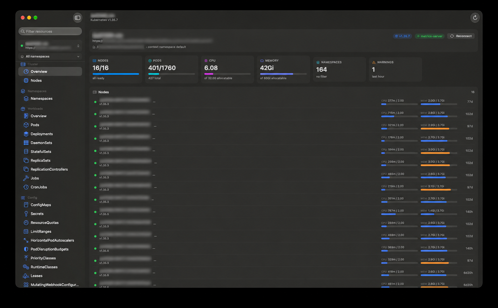

# Loupe

**A clear view of Kubernetes, built for macOS.**

Loupe is a native SwiftUI cluster browser. Open your kubeconfig contexts,
explore the resources your cluster actually serves, and move from an overview to
the object, event, log line, or shell you need. Loupe talks to the Kubernetes
API directly; it does not run `kubectl` or `helm`.



<sub>Cluster overview · Identifying details in this preview have been
blurred.</sub>

## What you can do

- **Browse everything your cluster exposes.** Live API discovery fills the
  sidebar, including custom resources. Lists use Kubernetes Table responses, so
  each kind gets the columns supplied by the API server.
- **Keep several clusters open.** Switch between kubeconfig contexts, narrow the
  namespace scope, and return to your last selection for each context.
- **See what needs attention.** Cluster and workload overviews show health,
  capacity, usage, and recent warnings. Metrics come from `metrics.k8s.io` or,
  when configured, Prometheus through the API server's service proxy.
- **Inspect and troubleshoot.** Open an object's overview, YAML, and events;
  stream pod or workload logs; open a pod shell; and forward a pod port to your
  Mac. Resource lists stay current with Kubernetes watches.
- **Make changes in place.** Edit YAML, delete resources, scale workloads,
  restart rollouts, manage CronJob schedules, and cordon or drain nodes.
  Available actions follow the resource and your cluster permissions.
- **Inspect Helm releases.** Browse Helm v3 releases and revisions directly from
  their release Secrets, including manifests and notes, without a Helm binary.

## Get started

Loupe requires **macOS 26.2 or later** and a working Kubernetes kubeconfig.

1. Download a DMG from
   [Releases](https://github.com/dylanblokhuis/loupe/releases) and drag Loupe
   into Applications.
2. Launch Loupe and choose a context from the cluster picker. It reads
   `~/.kube/config` by default and honors `KUBECONFIG` when that environment
   variable is available to the app.
3. Select a namespace scope, then choose a resource in the sidebar. Use
   **Settings → Kubeconfig** to inspect loaded files or reload them.

Your kubeconfig's credential plugins may still need to be installed and
accessible on your Mac. Loupe uses your existing cluster credentials and the
permissions granted to them.

### Build from source

You need **Xcode 26.2 or newer**. Open `loupe.xcodeproj` in Xcode, or build from
the repository root:

```bash
xcodebuild -project loupe.xcodeproj -scheme loupe -configuration Debug -destination 'platform=macOS' build
```

Xcode resolves the project's Swift package dependencies during the build. If you
need to resolve them separately:

```bash
xcodebuild -resolvePackageDependencies -project loupe.xcodeproj -scheme loupe
```

## How it works

Loupe is a direct Kubernetes API client. It discovers resource kinds at runtime,
requests their Table representation for lists, and keeps those lists fresh with
watches. Objects remain unstructured JSON throughout, which lets the same
browser handle built-in kinds and CRDs without generated models.

Connections use the credentials and certificate authority from kubeconfig. Loupe
can run a kubeconfig's exec credential plugin; `openssl` is used only when
client-certificate authentication needs a temporary PKCS#12 identity. No
cluster-side Loupe component is required.
